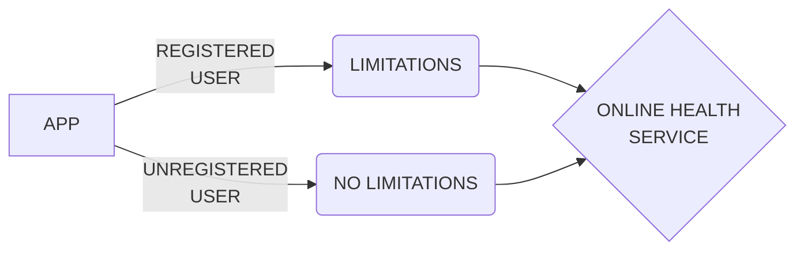

# Team Nealth404

Team Nealth404 consists of four brothers banded together for the sole purpose of creating a platform that will tackle the health error prevailing in Nepal for decades that includes general ignorance in the health sector in different forms.

## The Idea

...

### General System Flow

## Framework

The system is written in Dart using Flutter framework.

## Contribution

The code is contributed by:

- Bhaskar Rijal
- Sandeep Acharya
- Bishwa Kiran Poudel
- Pukar Bajgain

